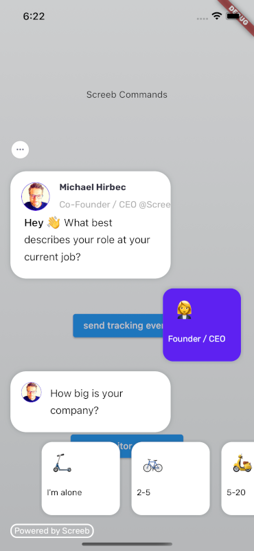

[](https://search.maven.org/search?q=g:%22app.screeb.sdk%22%20AND%20a:%22android-sdk%22)
[](https://cocoapods.org/pods/Screeb)

__:warning:  Android and iOS SDK have been released in beta. Please contact us [here](https://screeb.app/get-a-demo-of-screeb/) to request a demo.__

___

# Flutter demo app

Flutter demo app for Screeb



## Intro

This project is a starting point for a all developers who wish to integrate native Android & iOS
Screeb sdk in a Flutter project.

## SDK installation

For Android you need to add the Screeb sdk dependency in the Android build.gradle of the app, you'll find 
[the instructions](https://github.com/ScreebApp/DemoAppAndroid) on the repo of the Android demo app. 

For iOS you need to add the Screeb sdk dependency in the Podfile of the app, you'll find
[the instructions](https://github.com/ScreebApp/sdk-ios-public) on the repo of the iOs sdk.

## SDK configuration for Android

Like in the Android demo app, the access point of the SDK must be created in a custom Application class,
see `DemoApplication.kt`. You should create a Screeb instance using the builder and reference it in a
static variable to be used later in your app.

At this point, the SDK is installed and configured and can be used without any more operation.
But you'll probably need to communicate with it and send tracking information, declaring user's properties
or set user's identity.

To access these commands of the `Screeb.kt` class, we need to create a `MethodChannel` to configure 
the interface between flutter code and Android specific functions.

In `MainActivity.kt` a MethodChannel with name "screeb/commands" is configured to call Screeb functions
`setIdentity()`, `trackEvent()`, `trackScreen()` and `setVisitorProperties()`.

```kotlin
when (call.method) {
    "setIdentity" -> {
        val userId = call.argument<String>("userId")
        userId?.let {
            DemoApplication.screeb.setIdentity(it)
            result.success(true)
        } ?: result.error(
            "MISSING_ARGUMENT",
            "setIdentity function needs a userId parameter",
            null
        )
    }
}
```

## SDK configuration for iOS

The initialization point of the SDK must be created in the AppDelegate class,
see `AppDelegate.swift` in the `Runner` module. You should call the method Screeb.init(...) with a valid channelId
in parameter.

At this point, the SDK is installed and configured and can be used without any more operation.
But you'll probably need to communicate with it and send tracking information, declaring user's properties
or set user's identity.

To access these commands of the `Screeb.swift` class, we need to create a `MethodChannel` to configure
the interface between flutter code and iOS specific functions.

In `AppDelegate.swift` a MethodChannel with name "screeb/commands" is configured to call Screeb functions
`setIdentity()`, `trackEvent()`, `trackScreen()` and `setVisitorProperties()`.

```swift
            switch call.method {
                case "setIdentity":
                    guard let args = call.arguments else { return }
                    if let myArgs = args as? [String: Any], let userId = myArgs["userId"] as? String {
                        Screeb.setIdentity(uniqueVisitorId: userId)
                        result(true)
                    } else {
                        result(FlutterError(code: "-1",
                                            message: "iOS could not extract flutter arguments in method: \(call.method)",
                                            details: nil))
                    }
                    // (...) 
            }
```

## SDK usage in Flutter project

Then, to call these functions, you'll find in `main.dart` some examples using `platform.invokeMethod()` :

```dart
  static const platform = MethodChannel('screeb/commands');

  void identity() {
    platform.invokeMethod(
        'setIdentity', <String, dynamic>{'userId': 'flutter@screeb.app'});
  }
```

## Remove warnings

To remove warning from the Android SDK, just set a theme that inherits from `Theme.AppCompat`. In this project,
the theme `Theme.AppCompat.Light.NoActionBar` is used and should have no impact on the flutter UI styling.

## Troubleshooting

In case of problem, feel free to contact us or create an issue in this repository.
